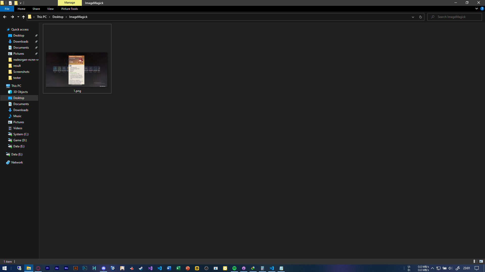
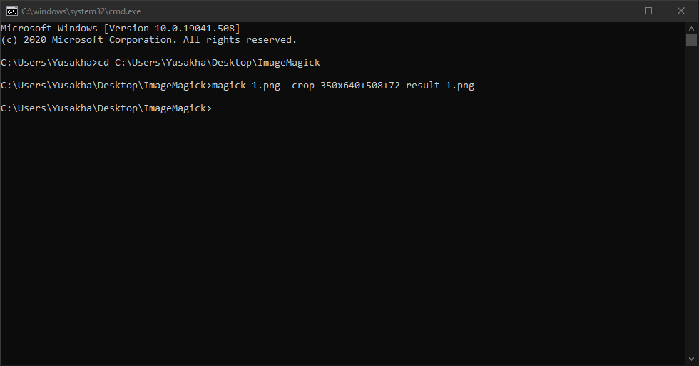
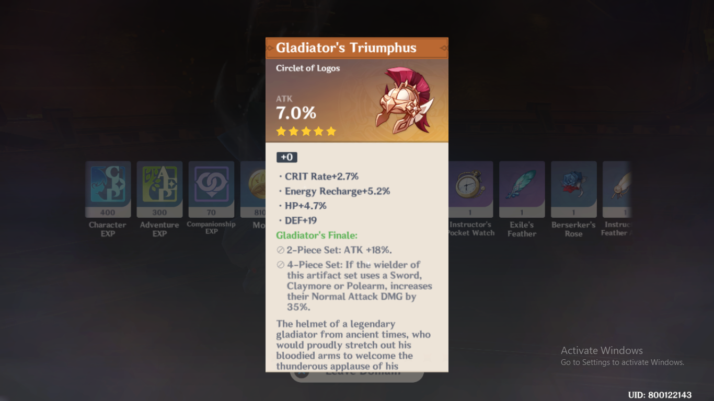
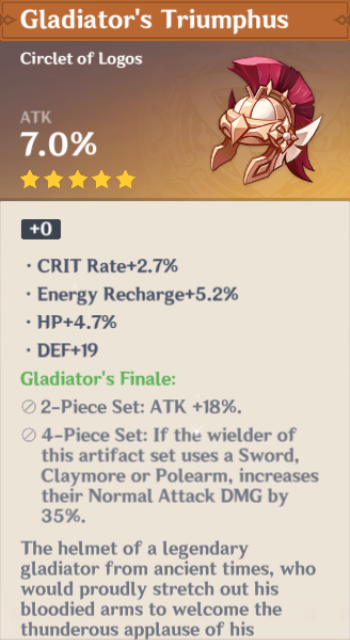

# Apa Itu ImageMagick?
  
ImageMagick adalah program gratis dan open source yang dibuat oleh John Cristy pada tahun 1987. Program ini memiliki fungsi untuk menampilkan, membuat, mengubah, memodifikasi, dan mengedit gambar. Program ini dapat membaca dan menulis lebih dari 200 format file gambar. Dan komponennya banyak digunakan dalam aplikasi open-source.

## Cropping gambar - ImageMagick
1. Pastikan anda sudah menginstall ImageMagick, jika belum maka install terlebih  
https://imagemagick.org/script/download.php
2. Tentukan folder dan isi folder tersebut dengan gambar dan ganti nama image menjadi "1"

3. Buka cmd dan change drirectori ke folder yang sudah di tentukan
4. Masukkan kode berikut  
```magick 1.png -crop WxH+X+Y hasil-1.png```  
Dimana: W dan H merupakan ukuran gambar setelah dicrop, X dan Y merupakan ukuran gambar yang ingin dipotong  
Contoh:

5. Selesai, hasilnya akan seperti ini



## Penutup
Ada banyak fitur yang ada pada ImageMagick, yang dapat membantu menampilkan, membuat, mengubah, memodifikasi, dan mengedit gambar projek kalian, saya sarankan untuk membaca dokumentasi git yang bisa dibaca disini : 
https://legacy.imagemagick.org/Usage/crop/