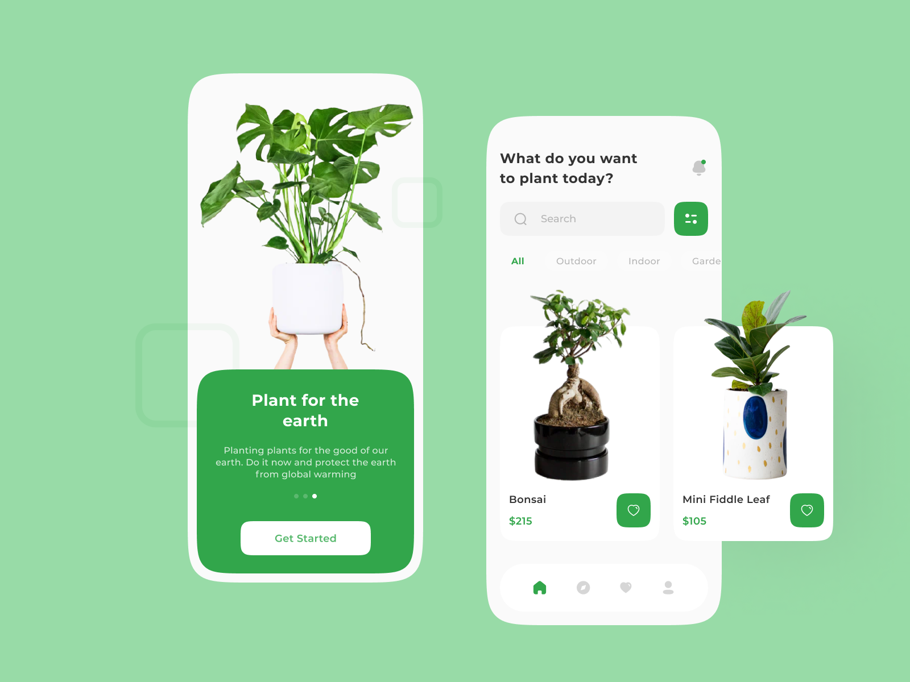

# Plant App UI Design

 
 

Plant App UI Design atau UI Design Aplikasi Tanaman Hias. Desain ini dibuat menggunakan [Figma](https://www.figma.com/). Desain ini memiliki konsep desain yang clean dan simple. 

# Komposisi Desain
<b>1. Penggunaan Warna</b>  
Waran yang digunakan dalam desain ini adalah :
Green   : #32A64B
Grey    : #D6D6D6
Black   : #333333
White   : #FFFFFF    

<b>2. Aset Gambar</b>  
Aset gambar yang digunakan di dalam desain ini diambil dari [Unsplash](https://www.unsplash.com/)    

<b>3. Penggunaan Font</b>  
Font yang digunakan di dalam desain ini adalah Montserrat. Font ini dapat di download di [sini](https://fonts.google.com/specimen/Montserrat)    

<b>4. Icon</b>  
Icon yang digunakan pada desain aplikasi ini adalah Iconly. Icon ini dapat ditemukan di Figma Community di [sini](https://www.figma.com/community/file/876509330914541878)   

Terimakasih telah membaca artikel ini. Kamu dapat menemukan desain lebih banyak di  
[Dribbble](https://dribbble.com/productexperience)
[Instagram](https://www.instagram.com/pxdesign.id/)

