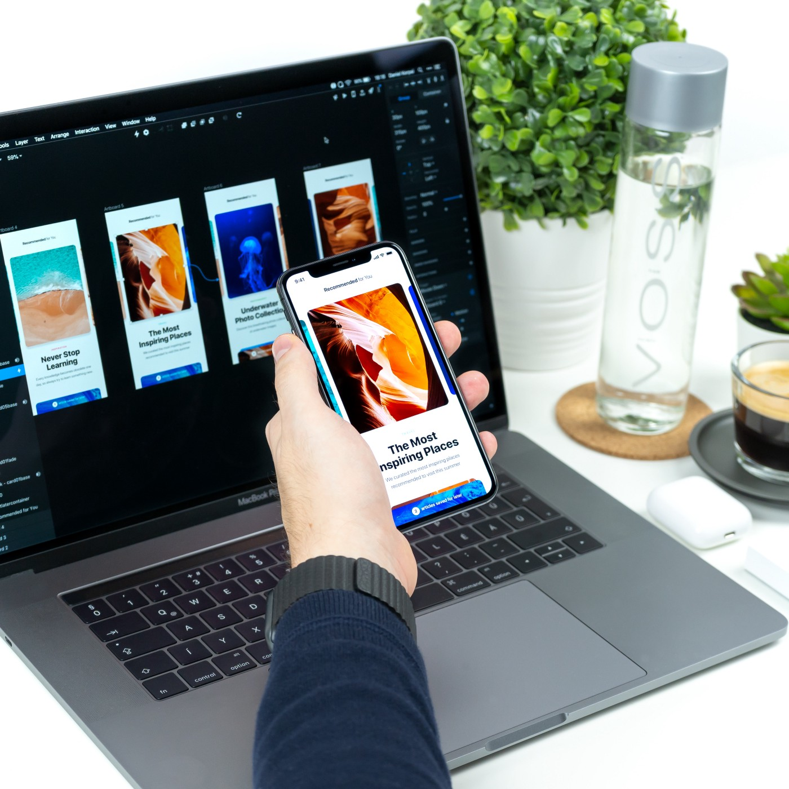

# UI/UX Tools

 

Halo disini saya ingin sharing rekomendasi tools untuk ui/ux , rekomendasi ini saya buat atas pengalaman saya menggunakan aplikasi tersebut, semoga bermanfaat kirang lebihnya mohoon maaf :D

1. Figma
2. Adobe XD
3. Adobe Photoshop
4. Adobe Ilustrator
5. Justmind
6. Balsamiq
7. Framer
8. Protopie
