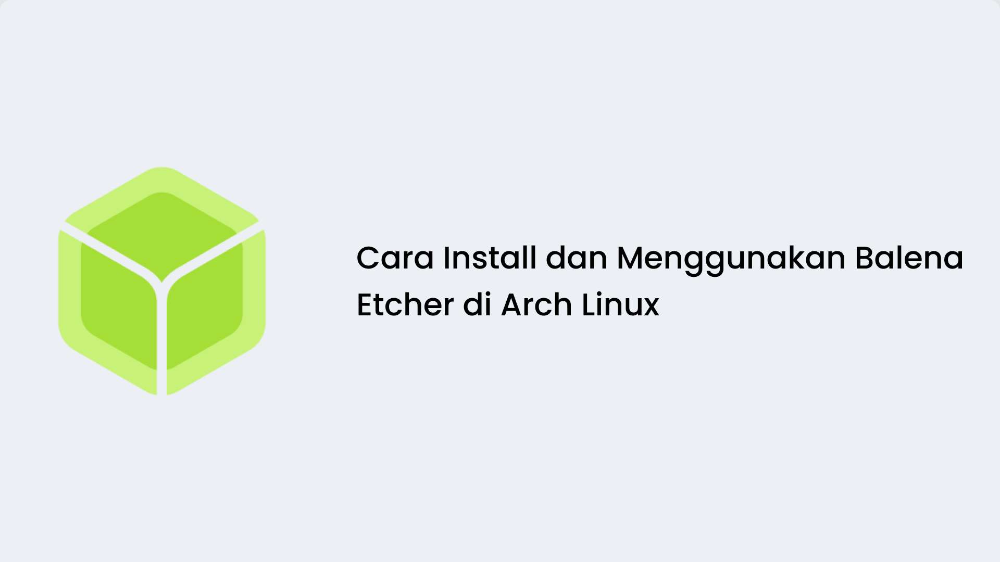
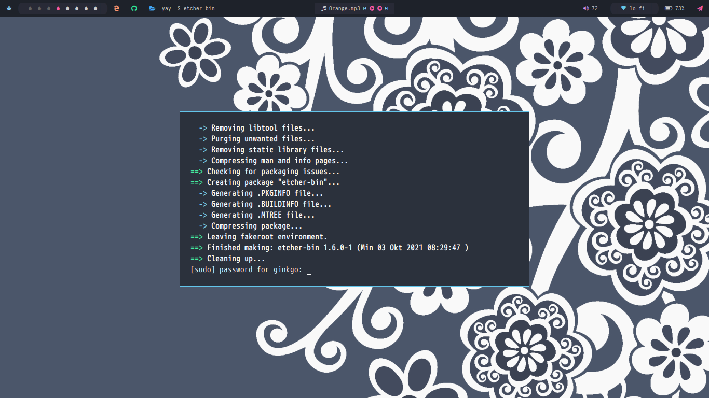
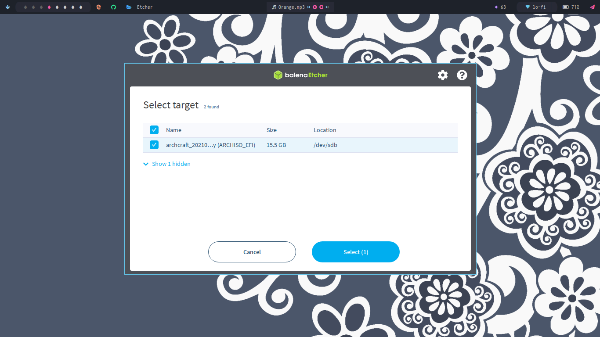

## A. Pendahuluan

Balena Etcher adalah salah satu program yang sering dipakai untuk membuat bootable flashdisk karena praktis dan mudah digunakan. Balena Etcher juga gratis dan open source. 

<br>

## B. Proses

Oke kita langsung ke tahapannya:

- Untuk menginstall Balena Etcher di Arch based, kita akan memilih binary releasenya aja. Masuk ke terminal, kemudian ketikkan 
  ```sh 
  yay -S etcher-bin
  ``` 
- Silahkan masukkan password anda jika diminta. 

- Perlu diingat, prosesnya ini agak lama, jadi kalian bisa melakukan aktivitas lain dulu atau sambil ngopi :D

  

<br>

Nah setelah terinstall, kita akan mencoba menggunakan Balena Etcher ini untuk membuat bootable. Disini saya akan membuat bootable Archcraft di FD 16gb. 

- Buka Balena Etcher
- Klik "Flash from file", kemudian kalian pilih file iso yang sudah disiapkan. 
- Setelah itu pilih "Select Target", kemudian pilih FD yang sudah kalian masukkan. 

  
  
- Prosesnya sendiri membutuhkan waktu beberapa menit(mungkin sekitar 5 menit atau lebih).
- Selesai. 
