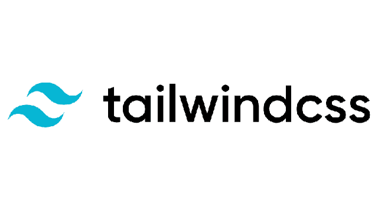

## Pendahuluan

Tailwind css adalah sebuah framework css yang menawarkan konsep utility first dimana kamu tidak perlu memikirkan panjang nama kelas untuk komponen HTML. Tailwind sendiri terdiri dari nama-nama kelas yang cukup intuitif seperti **flex**, **pt-4**, dan **text-center**.

Tailwind css ini dibuat oleh Adam Wathan pada pertengahan 2020. Tailwind menyediakan *class-class* kecil yang bisa digunakan dengan sangat fleksibel untuk membuat interface sesuai keinginan tanpa perlu *override styles* seperti pada framework lainnya.

Tailwind ini dapat kamu install menggunakan Node Package Manager (NPM) atau kamu dapat langsung memasangkan CDN nya di project yang kamu buat.

## Penginstalan tailwindcss aspect-ratio

Sekarang kita masuk ke pembahasan utama, disini saya akan menjelaskan mengenai cara crop image menggunakan aspect ratio. Untuk yang belum paham mengenai aspect ratio boleh lihat disini [Aspect Ratio](https://en.wikipedia.org/wiki/Aspect_ratio_(image)).

### Instalasi

Untuk proses instalasi, tailwindcss aspect-ratio ini dapat diinstall menggunakan NPM atau YARN

```bash

# Using npm
npm install @tailwindcss/aspect-ratio

# Using Yarn
yarn add @tailwindcss/aspect-ratio

```

lalu tambahkan plugin pada file `tailwind.config.js`:

```bash

// tailwind.config.js
module.exports = {
  theme: {
    // ...
  },
  plugins: [
    require('@tailwindcss/aspect-ratio'),
    // ...
  ],
}

```

### Cara penggunaan

Setelah berhasil menginstall, sekarang kita akan belajar cara menggunakannya. Caranya sangatlah mudah, kalian hanya tinggal menambahkan `aspect-w-{n}` dan `aspect-h-{n}` pada parent image/iframe kalian seperti contoh dibawah ini:

```bash

<div class="aspect-w-16 aspect-h-9">
  <iframe src="https://www.youtube.com/embed/dQw4w9WgXcQ" frameborder="0" allow="accelerometer; autoplay; clipboard-write; encrypted-media; gyroscope; picture-in-picture" allowfullscreen></iframe>
</div>

```

gimana, mudah bukan?
untuk menghilangkan aspect ratio yang sudah dibuat kalian bisa menambahkan `aspect-none` seperti pada contoh dibawah ini

```bash
<div class="aspect-w-16 aspect-h-9 lg:aspect-none">
  <!-- ... -->
</div>

```

Berikut adalah tabel dari class aspect ratio yang dapat kalian pakai:

| Width | Height |
| --- | --- |
| `aspect-w-1` | `aspect-h-1` |
| `aspect-w-2` | `aspect-h-2` |
| `aspect-w-3` | `aspect-h-3` |
| `aspect-w-4` | `aspect-h-4` |
| `aspect-w-5` | `aspect-h-5` |
| `aspect-w-6` | `aspect-h-6` |
| `aspect-w-7` | `aspect-h-7` |
| `aspect-w-8` | `aspect-h-8` |
| `aspect-w-9` | `aspect-h-9` |
| `aspect-w-10` | `aspect-h-10` |
| `aspect-w-11` | `aspect-h-11` |
| `aspect-w-12` | `aspect-h-12` |
| `aspect-w-13` | `aspect-h-13` |
| `aspect-w-14` | `aspect-h-14` |
| `aspect-w-15` | `aspect-h-15` |
| `aspect-w-16` | `aspect-h-16` |

### Konfigurasi

Bagi kalian yang ingin melakukan kustomisasi terhadap class aspect ratio ini, kalian dapat menambahkan varian atau menambah valuue yg ada pada `aspectRatio` melalui file `tailwind.config.js`

```js
// tailwind.config.js
module.exports = {
  theme: {
    aspectRatio: {
      1: '1',
      2: '2',
      3: '3',
      4: '4',
    }
  },
  variants: {
    aspectRatio: ['responsive', 'hover']
  }
}
```

Catatan: perlu diperhatikan juga, bahwa class ini tidak akan mempengaruhi ukuran asli image kalian, class ini hanya akan melakukan crop terhadap aspect ratio, dan class ini tidak akan berjalan kecuali image/parentnya memiliki *fixed width*.